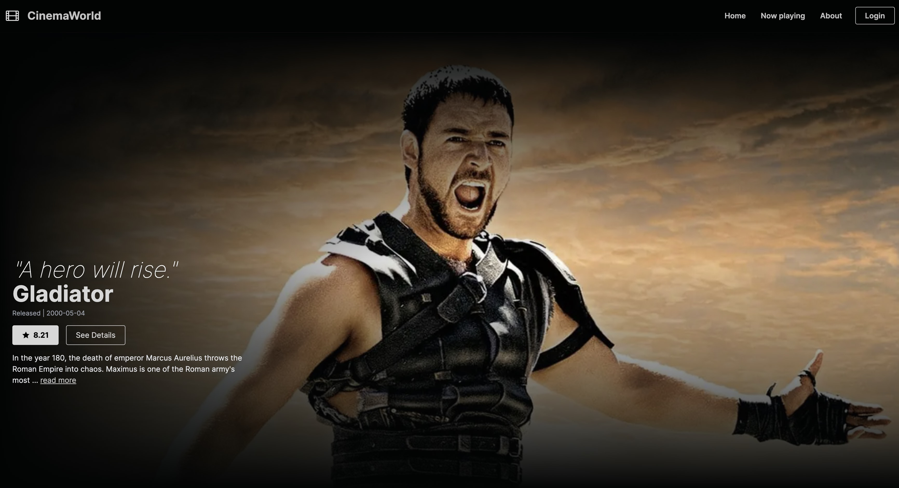

# CinemaWorld - Experience the enchantment of CinemaWorld, where extraordinary movies come to life

CinemaWorld is a modern web application built using Next.js that provides users with an immersive movie experience. This app leverages Next.js's built-in server-side rendering (SSR) capabilities to enhance initial page load times and improve search engine optimization (SEO). With dynamic routes for movie pages and responsive layouts using Tailwind CSS, CinemaWorld offers a seamless experience across various devices. Firebase is employed for user authentication/authorization and notification delivery, adding further functionality to the app.




## Features

- **Server-Side Rendering (SSR):** CinemaWorld harnesses Next.js's powerful SSR capabilities to render movie listings and details directly on the server. This results in faster initial page loads and better SEO performance.

- **Dynamic Movie Pages:** The app utilizes dynamic routes to allow users to access detailed information about specific movies without the need for a full page reload. This enhances user experience and navigation.

- **Firebase Integration:** CinemaWorld integrates Firebase for authentication and authorization purposes. Users can securely log in, ensuring their privacy and data security. Additionally, the app employs Firebase to send notifications to users, enhancing engagement and interaction.

- **Responsive Design:** The app is designed with a responsive layout using Tailwind CSS. This ensures a consistent and enjoyable experience across a variety of devices, from smartphones to desktops.

## Tech Stack

- **Next.js**, **App Router**

- **React**, **React Context**, **React-hook-form** 

- **TypeScript** 

- **Tailwind CSS** 

- **Firebase**

- **Yup**
  
## Getting Started

Follow these steps to set up the CinemaWorld app locally:

1. **Clone the Repository:**
   ```
   git clone https://github.com/your-username/cinemaworld.git
   ```

2. **Navigate to the Project Directory:**
   ```
   cd cinemaworld
   ```

3. **Install Dependencies:**
   ```
   npm install
   ```

4. **Configure Firebase:**
   - Create a Firebase project at [https://firebase.google.com](https://firebase.google.com) and obtain your project credentials.
   - Replace the placeholder Firebase configuration in `src/firebase-config.js` with your actual credentials.

5. **Run the Development Server:**
   ```
   npm run dev
   ```

6. **Open in Browser:**
   Visit [http://localhost:3000](http://localhost:3000) in your browser to explore CinemaWorld locally.

## Contributing

Contributions to CinemaWorld are welcome! If you find any issues or want to add new features, feel free to open a pull request. Please ensure to follow the project's coding standards and guidelines.

## License

This project is licensed under the [MIT License](LICENSE).

---

Feel free to explore, contribute, and enjoy the immersive movie experience offered by CinemaWorld. If you have any questions or feedback, don't hesitate to reach out to us.

*Disclaimer: CinemaWorld is a fictional project created for the purpose of this README.*
